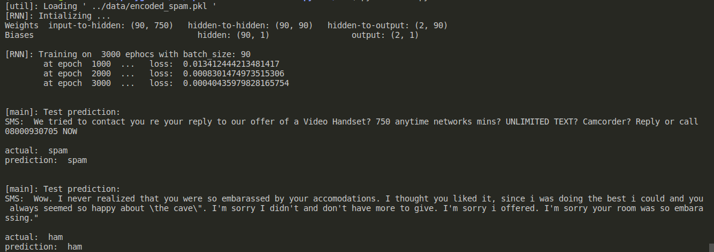

a simple Numpy based Recurrent neural network for classifying spam SMS messages, written using `numpy` library. this repo builded for own interest and with help of VictorZhou's intro to rnn [post](https://victorzhou.com/blog/intro-to-rnns/), it is great go and look at once.

### RNN structure

| |layer| size |
| :---: | :---: | :---: |
|0| input layer| (750, 1) |
|1| hidden layer| (90, 90) |
|2| output layer| (2, 1) |

#### Data set

I used [dataset](https://www.kaggle.com/uciml/sms-spam-collection-dataset) from kaggle website for training network.
I taken only 100 rows from this dataset and preprocessed very well that rnn can take. the preprocessed data available in `data/` as `encoded_spam.pkl`

You can take whole dataset and experiment by using `src/preprocessing.py`, if you wish. but you need additional libraries/packages.

you can find more processing ideas [here](https://www.kaggle.com/uciml/sms-spam-collection-dataset/notebooks).

#### Execution

* Go to `src` directory using `cd src`
* run `python main.py`

Note: Saving trained session of Network not implemented.  

#### sample output screen short

#### Lang\libraries\Tools
* `Python 3.8.3`
* `numpy`
* `pandas`
* `pickle`

### Acknowledgments
* Recurrent Neural Networks | MIT 6.S191 [link](https://www.youtube.com/watch?v=SEnXr6v2ifU&t=1407s)
* Victor Zhou [intro-to-rnn](https://victorzhou.com/blog/intro-to-rnns/)
* Dataset orginal [location](https://archive.ics.uci.edu/ml/datasets/SMS+Spam+Collection) and [creators](http://www.dt.fee.unicamp.br/~tiago/smsspamcollection/), you can find more info [here.](https://www.kaggle.com/uciml/sms-spam-collection-dataset)
* preprocessing help of [kaggle notebook](https://www.kaggle.com/redaabdou/sms-spam-solution-data-cleaning-ml)

